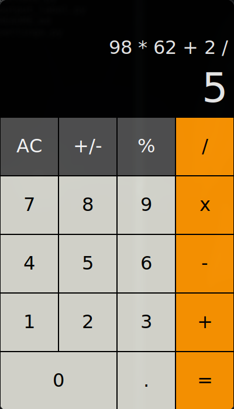

# calculator-app

### A calculator app with customtkinter

A calculator is a device that performs arithmetic operations on numbers. Basic calculators can do only addition, subtraction, multiplication and division mathematical calculations.

I didn't have any calculator on my Arch Linux and then I created it. I wanted it to be similar to the iPhone calculator, that's exactly what I did.


### Install requirements 

 
```
python -r requirements.txt

```


### Run 

Open the app folder and run the following command

```
python app.py

```

### Picture



